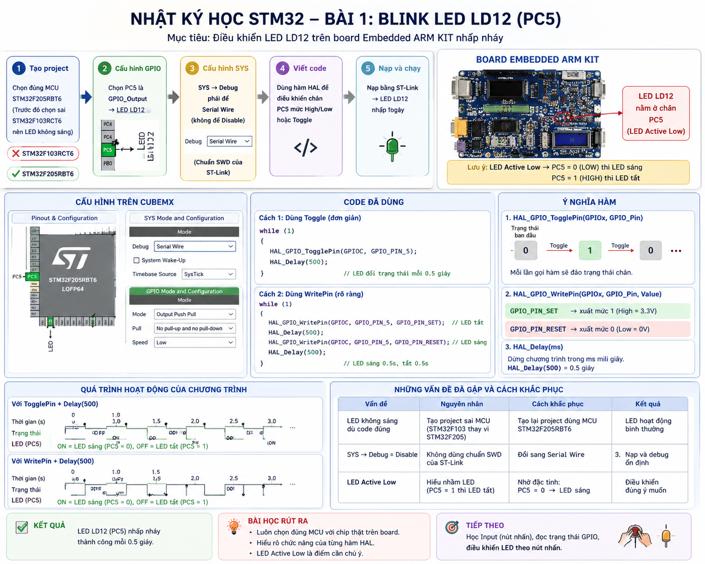
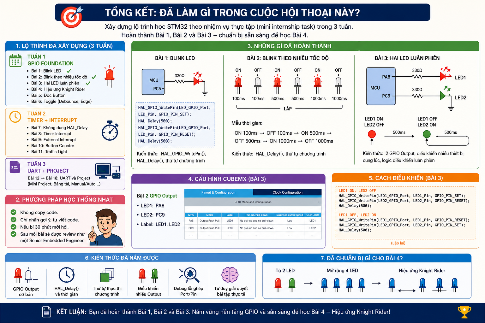
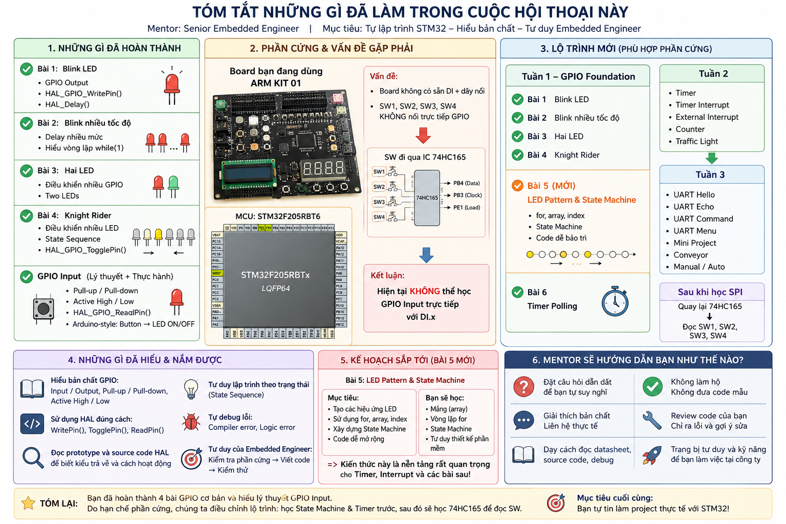
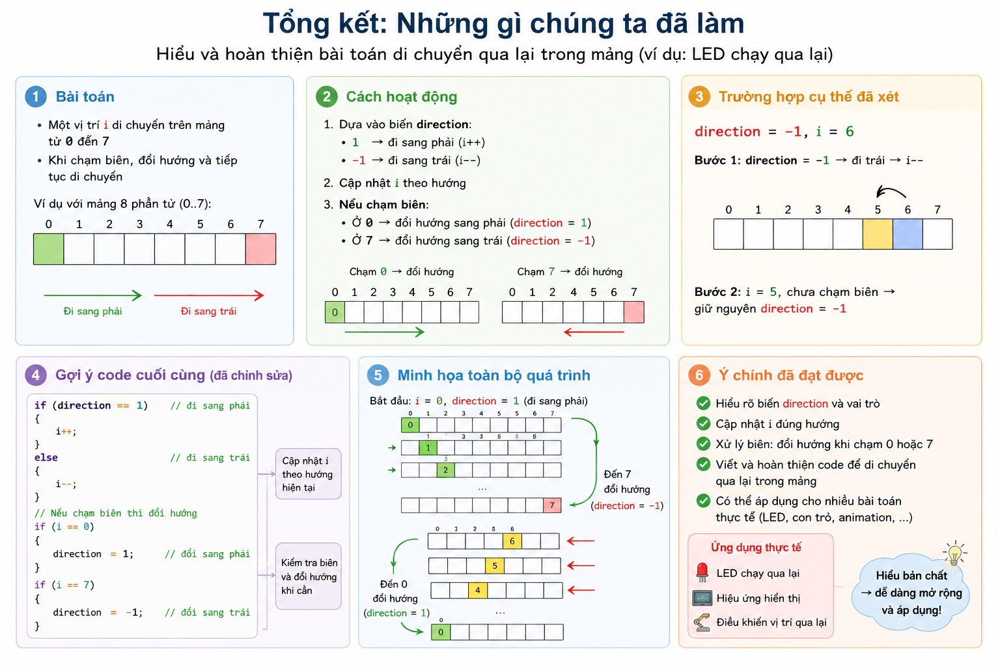
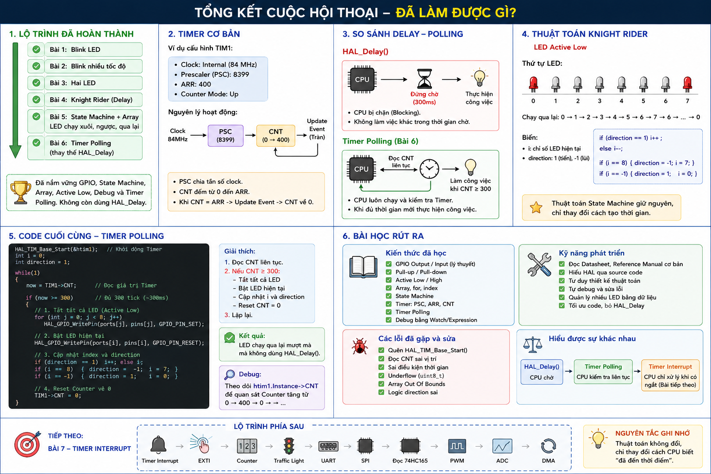
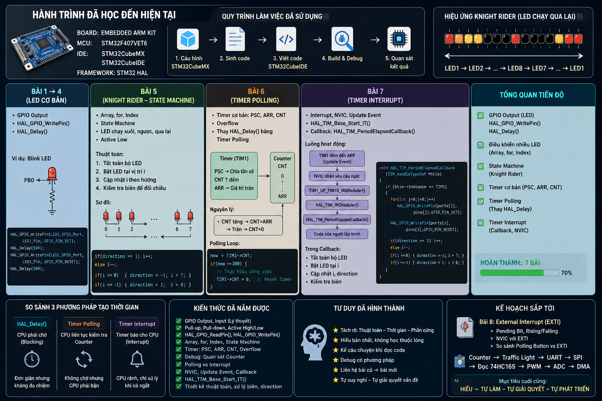
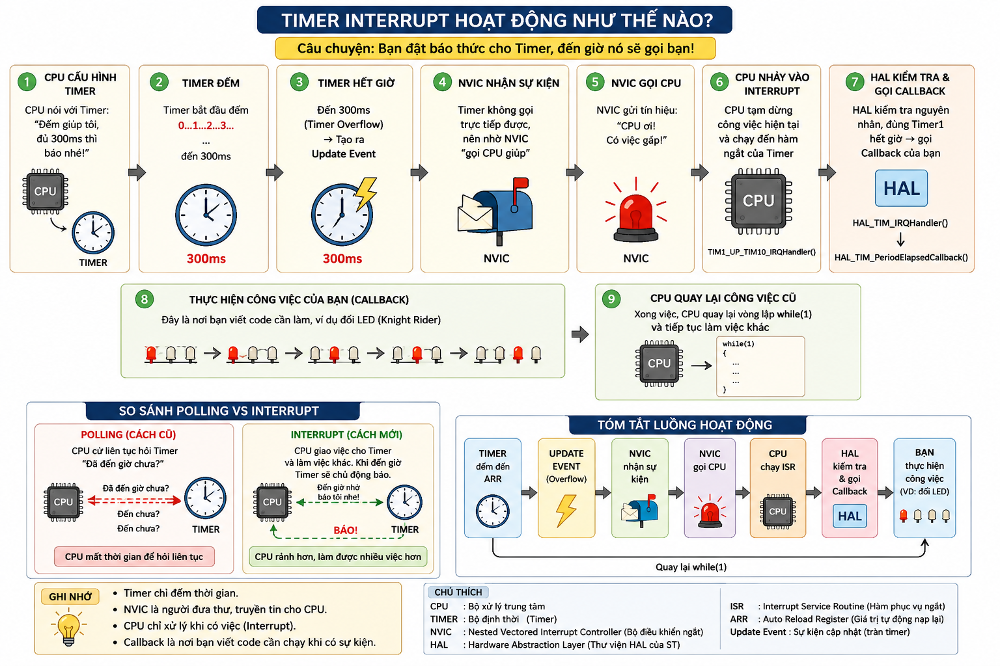

# 🚀 Học Lập Trình Với MCU STM32

<div align="center">

# STM32 Embedded Learning Journey


**Learning Embedded Systems from fundamentals to real projects using STM32.**

</div>

---

# 📖 Giới thiệu

Repository này lưu lại toàn bộ hành trình học lập trình nhúng với **STM32** theo định hướng trở thành **Embedded Software Engineer**.

Khác với một repository chỉ lưu source code, project này còn ghi lại:

* Quá trình học theo từng giai đoạn
* Kiến thức đã tiếp thu
* Các bài thực hành
* Infographic tự tổng hợp sau mỗi buổi học
* Những lỗi gặp phải và cách khắc phục
* Tư duy giải quyết bài toán trong Embedded Systems

Mục tiêu của repository là giúp bản thân nhìn lại quá trình phát triển, đồng thời chia sẻ tài liệu cho những người mới bắt đầu học STM32.

---

# 🎯 Mục tiêu

* Hiểu bản chất của STM32
* Thành thạo STM32CubeMX
* Thành thạo STM32CubeIDE
* Sử dụng HAL Library
* Biết đọc Datasheet
* Biết Debug chương trình
* Hiểu cách hoạt động của ngoại vi STM32
* Hình thành tư duy Embedded Software Engineer

---

# 🛠️ Công nghệ sử dụng

| Thành phần         | Công nghệ                     |
| ------------------ | ----------------------------- |
| MCU                | STM32F205RBT6 / STM32F407VET6 |
| IDE                | STM32CubeIDE                  |
| Configuration Tool | STM32CubeMX                   |
| Framework          | STM32 HAL Library             |
| Language           | Embedded C                    |
| Debug              | ST-Link                       |
| Version Control    | Git & GitHub                  |

---

# 💻 Phần cứng

* Embedded ARM KIT
* STM32F205RBT6
* STM32F407VET6
* ST-Link
* LED
* Push Button
* Timer

---

# 📚 Nội dung đã học

## GPIO

* GPIO Output
* GPIO Input
* Pull-up
* Pull-down
* Active High
* Active Low
* HAL_GPIO_WritePin()
* HAL_GPIO_ReadPin()
* HAL_GPIO_TogglePin()

---

## LED Programming

* Blink LED
* Blink nhiều tốc độ
* Hai LED luân phiên
* Điều khiển nhiều LED
* Knight Rider LED

---

## Data Structure

* Array
* Index
* For Loop

---

## State Machine

* Direction
* Boundary Checking
* State Transition
* Knight Rider Algorithm

---

## Timer

* Timer cơ bản
* PSC
* ARR
* CNT
* Timer Polling
* Timer Interrupt

---

## Interrupt

* NVIC
* ISR
* Callback
* HAL_TIM_IRQHandler()
* HAL_TIM_PeriodElapsedCallback()

---

## Debug

* Watch
* Expressions
* Breakpoint
* Counter
* Register

---

# 🗂️ Repository Structure

```text
lap_trinh_mcu
│
├── Day01
│
├── Day02
│
├── Day03
│
├── Documents
│
├── Images
│
│   ├── 1.png
│   ├── 2.png
│   ├── 3.png
│   ├── 4.png
│   ├── 5.png
│   ├── 6.png
│   └── 7.png
│
├── Source
│
└── README.md
```

---

# 📈 Learning Progress

| Chủ đề             | Trạng thái |
| ------------------ | ---------- |
| GPIO Output        | ✅          |
| GPIO Input         | ✅          |
| HAL Library        | ✅          |
| Array              | ✅          |
| State Machine      | ✅          |
| Timer              | ✅          |
| Timer Polling      | ✅          |
| Timer Interrupt    | ✅          |
| External Interrupt | ⏳          |
| UART               | ⏳          |
| PWM                | ⏳          |
| ADC                | ⏳          |
| SPI                | ⏳          |
| I2C                | ⏳          |
| DMA                | ⏳          |

---

# 📸 Learning Journey

Sau mỗi giai đoạn học, mình đều tự thiết kế infographic để tổng hợp lại kiến thức. Điều này giúp hệ thống hóa nội dung đã học, đồng thời dễ dàng xem lại khi cần.

---

## 📍 Giai đoạn 1 - STM32 GPIO Foundation

<p align="center">

</p>

### Nội dung

* Làm quen STM32CubeIDE
* STM32CubeMX
* GPIO Output
* HAL Library
* Blink LED
* Active Low
* HAL_GPIO_WritePin()
* HAL_GPIO_TogglePin()

---

## 📍 Giai đoạn 2 - GPIO Learning Roadmap

<p align="center">

</p>

### Nội dung

* Lộ trình học STM32
* Blink LED
* Blink nhiều tốc độ
* Hai LED
* CubeMX
* HAL
* Debug
* Chuẩn bị Knight Rider

---

## 📍 Giai đoạn 3 - State Machine

<p align="center">

</p>

### Nội dung

* Array
* Index
* Direction
* Boundary Checking
* State Machine
* Knight Rider Algorithm

Đây là bước chuyển từ việc chỉ điều khiển LED sang xây dựng tư duy thuật toán cho hệ thống nhúng.

---

## 📍 Giai đoạn 4 - Timer Polling

<p align="center">

</p>

### Nội dung

* Timer
* PSC
* ARR
* CNT
* Polling
* Timer Counter
* Thay thế HAL_Delay()
* Knight Rider bằng Timer Polling

Hiểu cách CPU chủ động kiểm tra Timer thay vì sử dụng Delay Blocking.

---

## 📍 Giai đoạn 5 - Learning Progress

<p align="center">

</p>

### Nội dung

* Tổng kết kiến thức
* Dashboard tiến độ
* Kiến thức đã hoàn thành
* Roadmap tiếp theo

---

## 📍 Giai đoạn 6 - Timer Interrupt

<p align="center">

</p>

### Nội dung

* Update Event
* NVIC
* Interrupt
* ISR
* Callback
* HAL_TIM_IRQHandler()
* HAL_TIM_PeriodElapsedCallback()

Hiểu luồng hoạt động của Timer Interrupt từ phần cứng đến phần mềm.

---

## 📍 Giai đoạn 7 - Embedded Workflow

<p align="center">

</p>

### Nội dung

* Embedded ARM KIT
* STM32 HAL
* Quy trình phát triển
* CubeMX
* Coding
* Build
* Debug
* Hardware Testing
* Dashboard kiến thức

Đây là bức tranh tổng quan về những gì đã hoàn thành trong giai đoạn đầu của quá trình học STM32.

---

# 🚀 Roadmap tiếp theo

```
GPIO
    │
    ▼
Timer
    │
    ▼
External Interrupt (EXTI)
    │
    ▼
Counter
    │
    ▼
Traffic Light
    │
    ▼
UART
    │
    ▼
SPI
    │
    ▼
74HC165
    │
    ▼
PWM
    │
    ▼
ADC
    │
    ▼
DMA
    │
    ▼
Mini Projects
```

---

# 💡 Điều mình học được

Qua quá trình thực hành, mình nhận ra rằng việc học STM32 không chỉ là viết chương trình để LED sáng hay tắt.

Điều quan trọng hơn là:

* Hiểu phần cứng hoạt động như thế nào.
* Biết tại sao chương trình chạy đúng hoặc sai.
* Biết đọc Datasheet và Reference Manual.
* Biết Debug thay vì đoán lỗi.
* Tách thuật toán khỏi phần cứng.
* Xây dựng chương trình theo State Machine.
* Hình thành tư duy của một Embedded Software Engineer.

---

# 🎯 Mục tiêu

Repository sẽ tiếp tục được cập nhật khi học thêm:

* External Interrupt
* UART
* SPI
* I2C
* PWM
* ADC
* DMA
* FreeRTOS
* Mini Projects
* Driver Development
* Bare Metal Programming

---

# 👨‍💻 Tác giả

**Nguyễn Ngọc Hùng**

* 🎓 Student - Electronics & Telecommunications
* 💻 Embedded Systems Enthusiast
* 🌱 Learning STM32 Embedded Development

---

<div align="center">

## ⭐ Nếu repository hữu ích, hãy cho một Star!

*"Learning by doing, understanding by debugging."*

</div>
